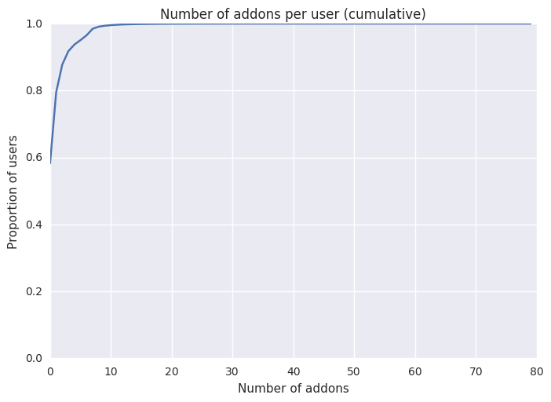
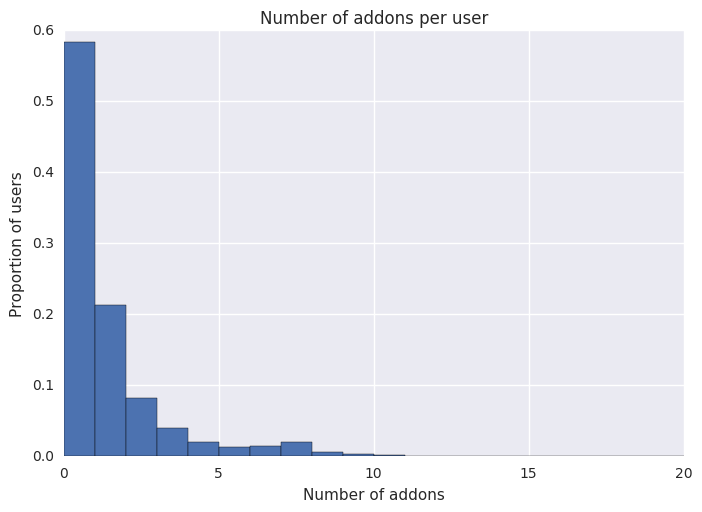
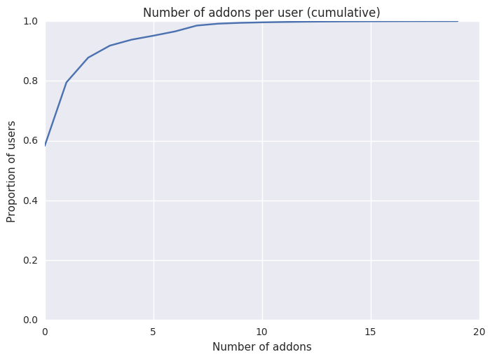

# TAAR – Evaluating existing recommenders

Not every recommender can always make a recommendation. To evaluate the individual recommenders for the ensemble, we want to find out how often this is the case and how well the recommenders complement each other.

This notebook either needs to be executed in the [TAAR](http://github.com/mozilla/taar) repository or somewhere where TAAR is in the Python path, because some TAAR recommenders are loaded in.

## Retrieving the relevant variables from the longitudinal dataset


```python
%%time
frame = sqlContext.sql("""
WITH valid_clients AS (
    SELECT *
    FROM longitudinal
    WHERE normalized_channel='release' AND build IS NOT NULL AND build[0].application_name='Firefox'
),

addons AS (
    SELECT client_id, feature_row.*
    FROM valid_clients
    LATERAL VIEW explode(active_addons[0]) feature_row
),
    
non_system_addons AS(
    SELECT client_id, collect_set(key) AS installed_addons
    FROM addons
    WHERE NOT value.is_system
    GROUP BY client_id
)

SELECT
    l.client_id,
    non_system_addons.installed_addons,
    settings[0].locale AS locale,
    geo_city[0] AS geoCity,
    subsession_length[0] AS subsessionLength,
    system_os[0].name AS os,
    scalar_parent_browser_engagement_total_uri_count[0].value AS total_uri,
    scalar_parent_browser_engagement_tab_open_event_count[0].value as tab_open_count,
    places_bookmarks_count[0].sum as bookmark_count,
    scalar_parent_browser_engagement_unique_domains_count[0].value as unique_tlds,
    profile_creation_date[0] as profile_date,
    submission_date[0] as submission_date
FROM valid_clients l LEFT OUTER JOIN non_system_addons
ON l.client_id = non_system_addons.client_id
""")

rdd = frame.rdd
```

    CPU times: user 196 ms, sys: 68 ms, total: 264 ms
    Wall time: 19min 5s


## Loading addon data (AMO)

We need to load the addon database to find out which addons are considered useful by TAAR.


```python
import boto3
import json
import logging

from botocore.exceptions import ClientError

logging.basicConfig(level=logging.INFO)
logger = logging.getLogger(__name__)

AMO_DUMP_BUCKET = 'telemetry-parquet'
AMO_DUMP_KEY = 'telemetry-ml/addon_recommender/addons_database.json'
```


```python
def load_amo_external_whitelist():
    """ Download and parse the AMO add-on whitelist.
    :raises RuntimeError: the AMO whitelist file cannot be downloaded or contains
                          no valid add-ons.
    """
    final_whitelist = []
    amo_dump = {}
    try:
        # Load the most current AMO dump JSON resource.
        s3 = boto3.client('s3')
        s3_contents = s3.get_object(Bucket=AMO_DUMP_BUCKET, Key=AMO_DUMP_KEY)
        amo_dump = json.loads(s3_contents['Body'].read())
    except ClientError:
        logger.exception("Failed to download from S3", extra={
            "bucket": AMO_DUMP_BUCKET,
            "key": AMO_DUMP_KEY})

    # If the load fails, we will have an empty whitelist, this may be problematic.
    for key, value in amo_dump.items():
        addon_files = value.get('current_version', {}).get('files', {})
        # If any of the addon files are web_extensions compatible, it can be recommended.
        if any([f.get("is_webextension", False) for f in addon_files]):
            final_whitelist.append(value['guid'])

    if len(final_whitelist) == 0:
        raise RuntimeError("Empty AMO whitelist detected")

    return final_whitelist
```


```python
whitelist = set(load_amo_external_whitelist())
```

    INFO:botocore.vendored.requests.packages.urllib3.connectionpool:Starting new HTTP connection (1): 169.254.169.254
    INFO:botocore.vendored.requests.packages.urllib3.connectionpool:Starting new HTTP connection (1): 169.254.169.254
    INFO:botocore.vendored.requests.packages.urllib3.connectionpool:Starting new HTTPS connection (1): s3-us-west-2.amazonaws.com


## Filtering out legacy addons 

This is a helper function that takes a list of addon IDs and only returns the IDs of addons that are useful for TAAR.


```python
def get_whitelisted_addons(installed_addons):
    return whitelist.intersection(installed_addons)
```

## Completing client data


```python
from dateutil.parser import parse as parse_date
from datetime import datetime
```


```python
def compute_weeks_ago(formatted_date):
    try:
        date = parse_date(formatted_date).replace(tzinfo=None)
    except ValueError: # raised when the date is in an unknown format
        return float("inf")
    
    days_ago = (datetime.today() - date).days
    return days_ago / 7
```


```python
def complete_client_data(client_data):
    client = client_data.asDict()
    
    client['installed_addons'] = client['installed_addons'] or []
    client['disabled_addon_ids'] = get_whitelisted_addons(client['installed_addons'])
    client['locale'] = str(client['locale'])
    client['profile_age_in_weeks'] = compute_weeks_ago(client['profile_date'])
    client['submission_age_in_weeks'] = compute_weeks_ago(client['submission_date'])
    
    return client
```

## Evaluating the existing recommenders

To check if a recommender is able to make a recommendation, it's sometimes easier and cleaner to directly query it instead of checking the important attributes ourselves. For example, this is the case for the locale recommender.


```python
from taar.recommenders import CollaborativeRecommender, LegacyRecommender, LocaleRecommender
```


```python
class DummySimilarityRecommender:
    def can_recommend(self, client_data):
        REQUIRED_FIELDS = ["geoCity", "subsessionLength", "locale", "os", "bookmark_count", "tab_open_count",
                           "total_uri", "unique_tlds"]

        has_fields = all([client_data.get(f, None) is not None for f in REQUIRED_FIELDS])
        return has_fields
```


```python
recommenders = {
    "collaborative": CollaborativeRecommender(),
    "legacy": LegacyRecommender(),
    "locale": LocaleRecommender(),
    "similarity": DummySimilarityRecommender()
}
```

    INFO:requests.packages.urllib3.connectionpool:Starting new HTTPS connection (1): s3-us-west-2.amazonaws.com
    INFO:requests.packages.urllib3.connectionpool:Starting new HTTPS connection (1): s3-us-west-2.amazonaws.com
    INFO:botocore.vendored.requests.packages.urllib3.connectionpool:Starting new HTTPS connection (1): s3-us-west-2.amazonaws.com
    INFO:botocore.vendored.requests.packages.urllib3.connectionpool:Starting new HTTPS connection (1): s3-us-west-2.amazonaws.com


```python
def test_recommenders(client):
    return tuple([recommender.can_recommend(client) for recommender in recommenders.values()])
```

## Computing combined counts

We iterate over all clients in the longitudinal dataset, change the attributes to the expected format and then query the individual recommenders.


```python
from operator import add
from collections import defaultdict
```


```python
rdd_completed = rdd.map(complete_client_data)
```


```python
def analyse(rdd):
    results = rdd\
        .map(test_recommenders)\
        .map(lambda x: (x, 1))\
        .reduceByKey(add)\
        .collect()
        
    return defaultdict(int, results)
```


```python
%time results = analyse(rdd_completed)
```

    CPU times: user 1.35 s, sys: 148 ms, total: 1.5 s
    Wall time: 11min 48s


```python
num_clients = sum(results.values())
total_results = results
```

## Computing individual counts


```python
individual_counts = []

for i in range(len(recommenders)):
    count = 0
    
    for key, key_count in results.items():
        if key[i]:
            count += key_count
            
    individual_counts.append(count)
```

## Displaying the results


```python
from pandas import DataFrame
```


```python
def format_int(num):
    return "{:,}".format(num)
```


```python
def format_frequency(frequency):
    return "%.5f" % frequency
```


```python
def get_relative_counts(counts, total=num_clients):
    return [format_frequency(count / float(total)) for count in counts]
```

This is a bit hacky. Sorting a data frame by formatted counts does not work; so we have to add the unformatted ones, sort the data frame, and then remove that column again.


```python
def sorted_dataframe(df, order, key="unformatted_counts"):
    df[key] = order
    return df.sort_values(by=key, ascending=False).drop(key, axis=1)
```

### Individual counts


```python
df = DataFrame(index=recommenders.keys(),
          columns=["Relative count"],
          data=get_relative_counts(individual_counts)
)

sorted_dataframe(df, individual_counts)
```


<div>
<table border="1" class="dataframe">
  <thead>
    <tr style="text-align: right;">
      <th></th>
      <th>Relative count</th>
    </tr>
  </thead>
  <tbody>
    <tr>
      <th>locale</th>
      <td>0.99977</td>
    </tr>
    <tr>
      <th>collaborative</th>
      <td>0.41949</td>
    </tr>
    <tr>
      <th>similarity</th>
      <td>0.28339</td>
    </tr>
    <tr>
      <th>legacy</th>
      <td>0.00000</td>
    </tr>
  </tbody>
</table>
</div>


$\implies$ The locale and collaborative recommenders are able to generate recommendations most of the time. The legacy recommender can only make recommendations very seldomly as not many users seem to have (legacy) addons installed.

### Combined counts

It's interesting to see how well the individual recommenders complement each other. In the following, we count how often different combinations of the recommenders can make recommendations.

The table is easier to read if cells are empty if a recommender is not available. If this is not desired, these variables can be changed:


```python
recommender_available_label = "Available"
recommender_unavailable_label = ""
```


```python
def format_labels(keys):
    return tuple([recommender_available_label if key else recommender_unavailable_label for key in keys])
```


```python
def format_data(keys, counts):
    formatted_keys = map(format_labels, keys)
    return [elems + count for elems, count in zip(formatted_keys, zip(*counts))]
```


```python
columns = recommenders.keys() + ["Relative counts"]

counts = get_relative_counts(results.values())
data = format_data(results.keys(), [counts])
```


```python
df = DataFrame(columns=columns, data=data)
sorted_dataframe(df, results.values())
```


<div>
<table border="1" class="dataframe">
  <thead>
    <tr style="text-align: right;">
      <th></th>
      <th>locale</th>
      <th>legacy</th>
      <th>collaborative</th>
      <th>similarity</th>
      <th>Relative counts</th>
    </tr>
  </thead>
  <tbody>
    <tr>
      <th>1</th>
      <td>Available</td>
      <td></td>
      <td></td>
      <td></td>
      <td>0.44747</td>
    </tr>
    <tr>
      <th>2</th>
      <td>Available</td>
      <td></td>
      <td>Available</td>
      <td></td>
      <td>0.26897</td>
    </tr>
    <tr>
      <th>0</th>
      <td>Available</td>
      <td></td>
      <td>Available</td>
      <td>Available</td>
      <td>0.15043</td>
    </tr>
    <tr>
      <th>4</th>
      <td>Available</td>
      <td></td>
      <td></td>
      <td>Available</td>
      <td>0.13290</td>
    </tr>
    <tr>
      <th>6</th>
      <td></td>
      <td></td>
      <td></td>
      <td></td>
      <td>0.00011</td>
    </tr>
    <tr>
      <th>5</th>
      <td></td>
      <td></td>
      <td>Available</td>
      <td></td>
      <td>0.00006</td>
    </tr>
    <tr>
      <th>7</th>
      <td></td>
      <td></td>
      <td>Available</td>
      <td>Available</td>
      <td>0.00003</td>
    </tr>
    <tr>
      <th>3</th>
      <td></td>
      <td></td>
      <td></td>
      <td>Available</td>
      <td>0.00003</td>
    </tr>
  </tbody>
</table>
</div>


$\implies$ If any recommender is available, then the locale recommenders is generally also available. Other than that, there is a good chance the the collaborative recommender is available.
There is only a very small portion of cases where the similarity recommender was able to make a recommendation, when locale/collaborative were not; and not a single such case for the legacy recommender.

### Grouped by number of available recommenders


```python
from itertools import groupby
from operator import itemgetter
```


```python
from IPython.display import display, Markdown
```


```python
for num, group in groupby(sorted(results.keys(), key=sum), sum):
    display(Markdown("#### %d available recommender%s" % (num, "s" if num != 1 else "")))
    
    sub_keys = list(group)
    formatted_keys = map(format_labels, sub_keys)
    
    sub_counts = [results[key] for key in sub_keys]
    sub_counts_to_total = get_relative_counts(sub_counts)
    sub_counts_to_table = get_relative_counts(sub_counts, sum(sub_counts))
    
    zipped_data = zip(formatted_keys, sub_counts_to_total, sub_counts_to_table)
    data = [elems + (counts, table_counts) for elems, counts, table_counts in zipped_data]
    
    columns = recommenders.keys() + ["Relative to all", "Relative to this table"]
    
    df = DataFrame(columns=columns, data=data)
    df = sorted_dataframe(df, sub_counts)
    display(df)
```


#### 0 available recommenders


<div>
<table border="1" class="dataframe">
  <thead>
    <tr style="text-align: right;">
      <th></th>
      <th>locale</th>
      <th>legacy</th>
      <th>collaborative</th>
      <th>similarity</th>
      <th>Relative to all</th>
      <th>Relative to this table</th>
    </tr>
  </thead>
  <tbody>
    <tr>
      <th>0</th>
      <td></td>
      <td></td>
      <td></td>
      <td></td>
      <td>0.00011</td>
      <td>1.00000</td>
    </tr>
  </tbody>
</table>
</div>


#### 1 available recommender


<div>
<table border="1" class="dataframe">
  <thead>
    <tr style="text-align: right;">
      <th></th>
      <th>locale</th>
      <th>legacy</th>
      <th>collaborative</th>
      <th>similarity</th>
      <th>Relative to all</th>
      <th>Relative to this table</th>
    </tr>
  </thead>
  <tbody>
    <tr>
      <th>0</th>
      <td>Available</td>
      <td></td>
      <td></td>
      <td></td>
      <td>0.44747</td>
      <td>0.99980</td>
    </tr>
    <tr>
      <th>2</th>
      <td></td>
      <td></td>
      <td>Available</td>
      <td></td>
      <td>0.00006</td>
      <td>0.00014</td>
    </tr>
    <tr>
      <th>1</th>
      <td></td>
      <td></td>
      <td></td>
      <td>Available</td>
      <td>0.00003</td>
      <td>0.00006</td>
    </tr>
  </tbody>
</table>
</div>


#### 2 available recommenders


<div>
<table border="1" class="dataframe">
  <thead>
    <tr style="text-align: right;">
      <th></th>
      <th>locale</th>
      <th>legacy</th>
      <th>collaborative</th>
      <th>similarity</th>
      <th>Relative to all</th>
      <th>Relative to this table</th>
    </tr>
  </thead>
  <tbody>
    <tr>
      <th>0</th>
      <td>Available</td>
      <td></td>
      <td>Available</td>
      <td></td>
      <td>0.26897</td>
      <td>0.66924</td>
    </tr>
    <tr>
      <th>1</th>
      <td>Available</td>
      <td></td>
      <td></td>
      <td>Available</td>
      <td>0.13290</td>
      <td>0.33068</td>
    </tr>
    <tr>
      <th>2</th>
      <td></td>
      <td></td>
      <td>Available</td>
      <td>Available</td>
      <td>0.00003</td>
      <td>0.00007</td>
    </tr>
  </tbody>
</table>
</div>


#### 3 available recommenders


<div>
<table border="1" class="dataframe">
  <thead>
    <tr style="text-align: right;">
      <th></th>
      <th>locale</th>
      <th>legacy</th>
      <th>collaborative</th>
      <th>similarity</th>
      <th>Relative to all</th>
      <th>Relative to this table</th>
    </tr>
  </thead>
  <tbody>
    <tr>
      <th>0</th>
      <td>Available</td>
      <td></td>
      <td>Available</td>
      <td>Available</td>
      <td>0.15043</td>
      <td>1.00000</td>
    </tr>
  </tbody>
</table>
</div>


## By dates

In this section, we perform a similar analysis as before but on subsets of the data. These subsets are specified by when the client profile was generated. `conditions` is a list that contains ranges for the profile age in weeks. The end of the range is exclusive, similar to ranges in Python's standard library.


```python
conditions = [
    (0, 1),
    (1, 2),
    (2, 3),
    (3, 4)
]
```


```python
import numpy as np
from numpy import argsort
from itertools import product
```


```python
def attribute_between(attr, min_weeks, max_weeks):
    return lambda client: min_weeks <= client[attr] < max_weeks
```


```python
def get_conditioned_results(attr, conditions):
    conditioned_results = {}

    for (min_weeks, max_weeks) in conditions:
        sub_rdd = rdd_completed.filter(attribute_between(attr, min_weeks, max_weeks))
        conditioned_results[(min_weeks, max_weeks)] = analyse(sub_rdd)
        
    return conditioned_results
```

### By profile age in weeks


```python
%time conditioned_results = get_conditioned_results("profile_age_in_weeks", conditions)
```

    CPU times: user 4.71 s, sys: 428 ms, total: 5.14 s
    Wall time: 46min 37s


To make things a little bit easier to read, only recommender combinations that actually appear are displayed in the table.


```python
def nonzero_combinations(conditioned_results):
    combinations = []

    for sub_result in conditioned_results.values():
        combinations += [key for key, value in sub_result.items() if value > 0]

    return set(combinations)
```


```python
combinations = nonzero_combinations(conditioned_results)
```


```python
def display_individual_filtered_results(conditioned_results, combinations, label):
    display(Markdown("### Filtering on the %s, Python-like exclusive ranges" % label))

    counts = []
    titles = []

    columns = recommenders.keys() + ["Relative counts"]

    for key in conditions:
        sub_results = conditioned_results[key]
        values = [sub_results[sub_key] for sub_key in combinations]
        summed = sum(values)

        sub_counts = get_relative_counts(values, summed)
        data = format_data(combinations, [sub_counts])
        counts.append(sub_counts)

        title = "Between %d and %d weeks" % key
        titles.append(title)
        display(Markdown("#### %s" % title))

        df = DataFrame(columns=columns, data=data)
        df = sorted_dataframe(df, values)
        display(df)

    return counts, titles
```


```python
counts, titles = display_individual_filtered_results(conditioned_results, combinations, label="profile age")
```


### Filtering on the profile age, Python-like exclusive ranges


#### Between 0 and 1 weeks


<div>
<table border="1" class="dataframe">
  <thead>
    <tr style="text-align: right;">
      <th></th>
      <th>locale</th>
      <th>legacy</th>
      <th>collaborative</th>
      <th>similarity</th>
      <th>Relative counts</th>
    </tr>
  </thead>
  <tbody>
    <tr>
      <th>1</th>
      <td>Available</td>
      <td></td>
      <td></td>
      <td></td>
      <td>0.52749</td>
    </tr>
    <tr>
      <th>2</th>
      <td>Available</td>
      <td></td>
      <td>Available</td>
      <td></td>
      <td>0.28995</td>
    </tr>
    <tr>
      <th>4</th>
      <td>Available</td>
      <td></td>
      <td></td>
      <td>Available</td>
      <td>0.10739</td>
    </tr>
    <tr>
      <th>0</th>
      <td>Available</td>
      <td></td>
      <td>Available</td>
      <td>Available</td>
      <td>0.07517</td>
    </tr>
    <tr>
      <th>3</th>
      <td></td>
      <td></td>
      <td></td>
      <td>Available</td>
      <td>0.00000</td>
    </tr>
    <tr>
      <th>5</th>
      <td></td>
      <td></td>
      <td>Available</td>
      <td></td>
      <td>0.00000</td>
    </tr>
    <tr>
      <th>6</th>
      <td></td>
      <td></td>
      <td></td>
      <td></td>
      <td>0.00000</td>
    </tr>
    <tr>
      <th>7</th>
      <td></td>
      <td></td>
      <td>Available</td>
      <td>Available</td>
      <td>0.00000</td>
    </tr>
  </tbody>
</table>
</div>


#### Between 1 and 2 weeks


<div>
<table border="1" class="dataframe">
  <thead>
    <tr style="text-align: right;">
      <th></th>
      <th>locale</th>
      <th>legacy</th>
      <th>collaborative</th>
      <th>similarity</th>
      <th>Relative counts</th>
    </tr>
  </thead>
  <tbody>
    <tr>
      <th>1</th>
      <td>Available</td>
      <td></td>
      <td></td>
      <td></td>
      <td>0.55644</td>
    </tr>
    <tr>
      <th>2</th>
      <td>Available</td>
      <td></td>
      <td>Available</td>
      <td></td>
      <td>0.22328</td>
    </tr>
    <tr>
      <th>4</th>
      <td>Available</td>
      <td></td>
      <td></td>
      <td>Available</td>
      <td>0.13656</td>
    </tr>
    <tr>
      <th>0</th>
      <td>Available</td>
      <td></td>
      <td>Available</td>
      <td>Available</td>
      <td>0.08356</td>
    </tr>
    <tr>
      <th>6</th>
      <td></td>
      <td></td>
      <td></td>
      <td></td>
      <td>0.00010</td>
    </tr>
    <tr>
      <th>5</th>
      <td></td>
      <td></td>
      <td>Available</td>
      <td></td>
      <td>0.00006</td>
    </tr>
    <tr>
      <th>7</th>
      <td></td>
      <td></td>
      <td>Available</td>
      <td>Available</td>
      <td>0.00001</td>
    </tr>
    <tr>
      <th>3</th>
      <td></td>
      <td></td>
      <td></td>
      <td>Available</td>
      <td>0.00000</td>
    </tr>
  </tbody>
</table>
</div>


#### Between 2 and 3 weeks


<div>
<table border="1" class="dataframe">
  <thead>
    <tr style="text-align: right;">
      <th></th>
      <th>locale</th>
      <th>legacy</th>
      <th>collaborative</th>
      <th>similarity</th>
      <th>Relative counts</th>
    </tr>
  </thead>
  <tbody>
    <tr>
      <th>1</th>
      <td>Available</td>
      <td></td>
      <td></td>
      <td></td>
      <td>0.53226</td>
    </tr>
    <tr>
      <th>2</th>
      <td>Available</td>
      <td></td>
      <td>Available</td>
      <td></td>
      <td>0.22522</td>
    </tr>
    <tr>
      <th>4</th>
      <td>Available</td>
      <td></td>
      <td></td>
      <td>Available</td>
      <td>0.14883</td>
    </tr>
    <tr>
      <th>0</th>
      <td>Available</td>
      <td></td>
      <td>Available</td>
      <td>Available</td>
      <td>0.09353</td>
    </tr>
    <tr>
      <th>5</th>
      <td></td>
      <td></td>
      <td>Available</td>
      <td></td>
      <td>0.00006</td>
    </tr>
    <tr>
      <th>6</th>
      <td></td>
      <td></td>
      <td></td>
      <td></td>
      <td>0.00006</td>
    </tr>
    <tr>
      <th>7</th>
      <td></td>
      <td></td>
      <td>Available</td>
      <td>Available</td>
      <td>0.00003</td>
    </tr>
    <tr>
      <th>3</th>
      <td></td>
      <td></td>
      <td></td>
      <td>Available</td>
      <td>0.00001</td>
    </tr>
  </tbody>
</table>
</div>


#### Between 3 and 4 weeks


<div>
<table border="1" class="dataframe">
  <thead>
    <tr style="text-align: right;">
      <th></th>
      <th>locale</th>
      <th>legacy</th>
      <th>collaborative</th>
      <th>similarity</th>
      <th>Relative counts</th>
    </tr>
  </thead>
  <tbody>
    <tr>
      <th>1</th>
      <td>Available</td>
      <td></td>
      <td></td>
      <td></td>
      <td>0.52304</td>
    </tr>
    <tr>
      <th>2</th>
      <td>Available</td>
      <td></td>
      <td>Available</td>
      <td></td>
      <td>0.22984</td>
    </tr>
    <tr>
      <th>4</th>
      <td>Available</td>
      <td></td>
      <td></td>
      <td>Available</td>
      <td>0.14583</td>
    </tr>
    <tr>
      <th>0</th>
      <td>Available</td>
      <td></td>
      <td>Available</td>
      <td>Available</td>
      <td>0.10121</td>
    </tr>
    <tr>
      <th>6</th>
      <td></td>
      <td></td>
      <td></td>
      <td></td>
      <td>0.00005</td>
    </tr>
    <tr>
      <th>5</th>
      <td></td>
      <td></td>
      <td>Available</td>
      <td></td>
      <td>0.00003</td>
    </tr>
    <tr>
      <th>7</th>
      <td></td>
      <td></td>
      <td>Available</td>
      <td>Available</td>
      <td>0.00002</td>
    </tr>
    <tr>
      <th>3</th>
      <td></td>
      <td></td>
      <td></td>
      <td>Available</td>
      <td>0.00000</td>
    </tr>
  </tbody>
</table>
</div>


To make things a little bit easier to read, we can display all results in a single table.


```python
def display_merged_filtered_results(counts, titles, total_results, combinations, label):
    values = [total_results[sub_key] for sub_key in combinations]
    sub_counts = get_relative_counts(values)
    counts.append(sub_counts)
    titles.append("Total, without any condition")  

    columns = recommenders.keys() + titles
    data = format_data(combinations, counts)

    df = DataFrame(columns=columns, data=data)
    df = sorted_dataframe(df, counts[0])

    display(Markdown("### Filtering on the %s, Python-like exclusive ranges – All in one table" % label))
    display(df)
```


```python
display_merged_filtered_results(counts, titles, total_results, combinations, label="profile age")
```


### Filtering on the profile age, Python-like exclusive ranges – All in one table


<div>
<table border="1" class="dataframe">
  <thead>
    <tr style="text-align: right;">
      <th></th>
      <th>locale</th>
      <th>legacy</th>
      <th>collaborative</th>
      <th>similarity</th>
      <th>Between 0 and 1 weeks</th>
      <th>Between 1 and 2 weeks</th>
      <th>Between 2 and 3 weeks</th>
      <th>Between 3 and 4 weeks</th>
      <th>Total, without any condition</th>
    </tr>
  </thead>
  <tbody>
    <tr>
      <th>1</th>
      <td>Available</td>
      <td></td>
      <td></td>
      <td></td>
      <td>0.52749</td>
      <td>0.55644</td>
      <td>0.53226</td>
      <td>0.52304</td>
      <td>0.44747</td>
    </tr>
    <tr>
      <th>2</th>
      <td>Available</td>
      <td></td>
      <td>Available</td>
      <td></td>
      <td>0.28995</td>
      <td>0.22328</td>
      <td>0.22522</td>
      <td>0.22984</td>
      <td>0.26897</td>
    </tr>
    <tr>
      <th>4</th>
      <td>Available</td>
      <td></td>
      <td></td>
      <td>Available</td>
      <td>0.10739</td>
      <td>0.13656</td>
      <td>0.14883</td>
      <td>0.14583</td>
      <td>0.13290</td>
    </tr>
    <tr>
      <th>0</th>
      <td>Available</td>
      <td></td>
      <td>Available</td>
      <td>Available</td>
      <td>0.07517</td>
      <td>0.08356</td>
      <td>0.09353</td>
      <td>0.10121</td>
      <td>0.15043</td>
    </tr>
    <tr>
      <th>3</th>
      <td></td>
      <td></td>
      <td></td>
      <td>Available</td>
      <td>0.00000</td>
      <td>0.00000</td>
      <td>0.00001</td>
      <td>0.00000</td>
      <td>0.00003</td>
    </tr>
    <tr>
      <th>5</th>
      <td></td>
      <td></td>
      <td>Available</td>
      <td></td>
      <td>0.00000</td>
      <td>0.00006</td>
      <td>0.00006</td>
      <td>0.00003</td>
      <td>0.00006</td>
    </tr>
    <tr>
      <th>6</th>
      <td></td>
      <td></td>
      <td></td>
      <td></td>
      <td>0.00000</td>
      <td>0.00010</td>
      <td>0.00006</td>
      <td>0.00005</td>
      <td>0.00011</td>
    </tr>
    <tr>
      <th>7</th>
      <td></td>
      <td></td>
      <td>Available</td>
      <td>Available</td>
      <td>0.00000</td>
      <td>0.00001</td>
      <td>0.00003</td>
      <td>0.00002</td>
      <td>0.00003</td>
    </tr>
  </tbody>
</table>
</div>


### By submission date in weeks


```python
%time conditioned_results_submission_date = get_conditioned_results("submission_age_in_weeks", conditions)
```

    CPU times: user 4.8 s, sys: 324 ms, total: 5.12 s
    Wall time: 46min 36s


```python
label = "submission date"
combinations = nonzero_combinations(conditioned_results_submission_date)
counts, titles = display_individual_filtered_results(conditioned_results_submission_date, combinations, label)
display_merged_filtered_results(counts, titles, total_results, combinations, label)
```


### Filtering on the submission date, Python-like exclusive ranges


#### Between 0 and 1 weeks


<div>
<table border="1" class="dataframe">
  <thead>
    <tr style="text-align: right;">
      <th></th>
      <th>locale</th>
      <th>legacy</th>
      <th>collaborative</th>
      <th>similarity</th>
      <th>Relative counts</th>
    </tr>
  </thead>
  <tbody>
    <tr>
      <th>0</th>
      <td>Available</td>
      <td></td>
      <td>Available</td>
      <td>Available</td>
      <td>0.30124</td>
    </tr>
    <tr>
      <th>2</th>
      <td>Available</td>
      <td></td>
      <td>Available</td>
      <td></td>
      <td>0.25782</td>
    </tr>
    <tr>
      <th>1</th>
      <td>Available</td>
      <td></td>
      <td></td>
      <td></td>
      <td>0.25026</td>
    </tr>
    <tr>
      <th>4</th>
      <td>Available</td>
      <td></td>
      <td></td>
      <td>Available</td>
      <td>0.19053</td>
    </tr>
    <tr>
      <th>6</th>
      <td></td>
      <td></td>
      <td></td>
      <td></td>
      <td>0.00005</td>
    </tr>
    <tr>
      <th>3</th>
      <td></td>
      <td></td>
      <td></td>
      <td>Available</td>
      <td>0.00005</td>
    </tr>
    <tr>
      <th>7</th>
      <td></td>
      <td></td>
      <td>Available</td>
      <td>Available</td>
      <td>0.00003</td>
    </tr>
    <tr>
      <th>5</th>
      <td></td>
      <td></td>
      <td>Available</td>
      <td></td>
      <td>0.00002</td>
    </tr>
  </tbody>
</table>
</div>


#### Between 1 and 2 weeks


<div>
<table border="1" class="dataframe">
  <thead>
    <tr style="text-align: right;">
      <th></th>
      <th>locale</th>
      <th>legacy</th>
      <th>collaborative</th>
      <th>similarity</th>
      <th>Relative counts</th>
    </tr>
  </thead>
  <tbody>
    <tr>
      <th>1</th>
      <td>Available</td>
      <td></td>
      <td></td>
      <td></td>
      <td>0.37644</td>
    </tr>
    <tr>
      <th>2</th>
      <td>Available</td>
      <td></td>
      <td>Available</td>
      <td></td>
      <td>0.24523</td>
    </tr>
    <tr>
      <th>0</th>
      <td>Available</td>
      <td></td>
      <td>Available</td>
      <td>Available</td>
      <td>0.19097</td>
    </tr>
    <tr>
      <th>4</th>
      <td>Available</td>
      <td></td>
      <td></td>
      <td>Available</td>
      <td>0.18718</td>
    </tr>
    <tr>
      <th>6</th>
      <td></td>
      <td></td>
      <td></td>
      <td></td>
      <td>0.00008</td>
    </tr>
    <tr>
      <th>5</th>
      <td></td>
      <td></td>
      <td>Available</td>
      <td></td>
      <td>0.00004</td>
    </tr>
    <tr>
      <th>7</th>
      <td></td>
      <td></td>
      <td>Available</td>
      <td>Available</td>
      <td>0.00003</td>
    </tr>
    <tr>
      <th>3</th>
      <td></td>
      <td></td>
      <td></td>
      <td>Available</td>
      <td>0.00002</td>
    </tr>
  </tbody>
</table>
</div>


#### Between 2 and 3 weeks


<div>
<table border="1" class="dataframe">
  <thead>
    <tr style="text-align: right;">
      <th></th>
      <th>locale</th>
      <th>legacy</th>
      <th>collaborative</th>
      <th>similarity</th>
      <th>Relative counts</th>
    </tr>
  </thead>
  <tbody>
    <tr>
      <th>1</th>
      <td>Available</td>
      <td></td>
      <td></td>
      <td></td>
      <td>0.46093</td>
    </tr>
    <tr>
      <th>2</th>
      <td>Available</td>
      <td></td>
      <td>Available</td>
      <td></td>
      <td>0.27125</td>
    </tr>
    <tr>
      <th>0</th>
      <td>Available</td>
      <td></td>
      <td>Available</td>
      <td>Available</td>
      <td>0.13411</td>
    </tr>
    <tr>
      <th>4</th>
      <td>Available</td>
      <td></td>
      <td></td>
      <td>Available</td>
      <td>0.13353</td>
    </tr>
    <tr>
      <th>6</th>
      <td></td>
      <td></td>
      <td></td>
      <td></td>
      <td>0.00009</td>
    </tr>
    <tr>
      <th>5</th>
      <td></td>
      <td></td>
      <td>Available</td>
      <td></td>
      <td>0.00005</td>
    </tr>
    <tr>
      <th>3</th>
      <td></td>
      <td></td>
      <td></td>
      <td>Available</td>
      <td>0.00002</td>
    </tr>
    <tr>
      <th>7</th>
      <td></td>
      <td></td>
      <td>Available</td>
      <td>Available</td>
      <td>0.00002</td>
    </tr>
  </tbody>
</table>
</div>


#### Between 3 and 4 weeks


<div>
<table border="1" class="dataframe">
  <thead>
    <tr style="text-align: right;">
      <th></th>
      <th>locale</th>
      <th>legacy</th>
      <th>collaborative</th>
      <th>similarity</th>
      <th>Relative counts</th>
    </tr>
  </thead>
  <tbody>
    <tr>
      <th>1</th>
      <td>Available</td>
      <td></td>
      <td></td>
      <td></td>
      <td>0.47828</td>
    </tr>
    <tr>
      <th>2</th>
      <td>Available</td>
      <td></td>
      <td>Available</td>
      <td></td>
      <td>0.27232</td>
    </tr>
    <tr>
      <th>0</th>
      <td>Available</td>
      <td></td>
      <td>Available</td>
      <td>Available</td>
      <td>0.12519</td>
    </tr>
    <tr>
      <th>4</th>
      <td>Available</td>
      <td></td>
      <td></td>
      <td>Available</td>
      <td>0.12397</td>
    </tr>
    <tr>
      <th>6</th>
      <td></td>
      <td></td>
      <td></td>
      <td></td>
      <td>0.00015</td>
    </tr>
    <tr>
      <th>5</th>
      <td></td>
      <td></td>
      <td>Available</td>
      <td></td>
      <td>0.00005</td>
    </tr>
    <tr>
      <th>3</th>
      <td></td>
      <td></td>
      <td></td>
      <td>Available</td>
      <td>0.00002</td>
    </tr>
    <tr>
      <th>7</th>
      <td></td>
      <td></td>
      <td>Available</td>
      <td>Available</td>
      <td>0.00002</td>
    </tr>
  </tbody>
</table>
</div>


### Filtering on the submission date, Python-like exclusive ranges – All in one table


<div>
<table border="1" class="dataframe">
  <thead>
    <tr style="text-align: right;">
      <th></th>
      <th>locale</th>
      <th>legacy</th>
      <th>collaborative</th>
      <th>similarity</th>
      <th>Between 0 and 1 weeks</th>
      <th>Between 1 and 2 weeks</th>
      <th>Between 2 and 3 weeks</th>
      <th>Between 3 and 4 weeks</th>
      <th>Total, without any condition</th>
    </tr>
  </thead>
  <tbody>
    <tr>
      <th>0</th>
      <td>Available</td>
      <td></td>
      <td>Available</td>
      <td>Available</td>
      <td>0.30124</td>
      <td>0.19097</td>
      <td>0.13411</td>
      <td>0.12519</td>
      <td>0.15043</td>
    </tr>
    <tr>
      <th>2</th>
      <td>Available</td>
      <td></td>
      <td>Available</td>
      <td></td>
      <td>0.25782</td>
      <td>0.24523</td>
      <td>0.27125</td>
      <td>0.27232</td>
      <td>0.26897</td>
    </tr>
    <tr>
      <th>1</th>
      <td>Available</td>
      <td></td>
      <td></td>
      <td></td>
      <td>0.25026</td>
      <td>0.37644</td>
      <td>0.46093</td>
      <td>0.47828</td>
      <td>0.44747</td>
    </tr>
    <tr>
      <th>4</th>
      <td>Available</td>
      <td></td>
      <td></td>
      <td>Available</td>
      <td>0.19053</td>
      <td>0.18718</td>
      <td>0.13353</td>
      <td>0.12397</td>
      <td>0.13290</td>
    </tr>
    <tr>
      <th>3</th>
      <td></td>
      <td></td>
      <td></td>
      <td>Available</td>
      <td>0.00005</td>
      <td>0.00002</td>
      <td>0.00002</td>
      <td>0.00002</td>
      <td>0.00003</td>
    </tr>
    <tr>
      <th>6</th>
      <td></td>
      <td></td>
      <td></td>
      <td></td>
      <td>0.00005</td>
      <td>0.00008</td>
      <td>0.00009</td>
      <td>0.00015</td>
      <td>0.00011</td>
    </tr>
    <tr>
      <th>7</th>
      <td></td>
      <td></td>
      <td>Available</td>
      <td>Available</td>
      <td>0.00003</td>
      <td>0.00003</td>
      <td>0.00002</td>
      <td>0.00002</td>
      <td>0.00003</td>
    </tr>
    <tr>
      <th>5</th>
      <td></td>
      <td></td>
      <td>Available</td>
      <td></td>
      <td>0.00002</td>
      <td>0.00004</td>
      <td>0.00005</td>
      <td>0.00005</td>
      <td>0.00006</td>
    </tr>
  </tbody>
</table>
</div>


## Addon counts

We want to train an ensemble model using the individual recommenders that we already have. To optimize this ensemble model, we need some training data. We have information about what addons different users have installed, so it would make sense to check if our ensemble model would also recommend these addons to the respective users.

However, there is one fundamental conflict here: To be able to make recommendations, the collaborative recommender already needs some information about which addons a user has installed. Thus, we can only use a subset of a user's installed addons for evaluation. These addons are masked and the collaborative recommender then only uses the unmasked addons. The open question is how large this subset of masked addons should be.

Choosing this size is a trade-off between three factors:
1. By masking more addons, we give the evaluation function more data to work with
2. If we mask fewer addons, the collaborative filter can make better recommendations
3. There are not that many users who have many addons installed. This means we need to be careful not to make our evaluation set too biased. For example, if we always mask at least five addons, then only users with more than six addons could be part of the evaluation set, which is a small subset of the entire population

To be able to make this decision, it's helpful to look at the distribution of the number of addons that users have installed.


```python
import matplotlib.pyplot as plt
import seaborn as sns
%matplotlib inline
sns.set(style="darkgrid")
```


```python
addon_counts = rdd_completed\
    .map(lambda client: len(client['installed_addons']))\
    .map(lambda x: (x, 1))\
    .reduceByKey(add)\
    .collect()
    
addon_counts = sorted(addon_counts, key=itemgetter(0))
```


```python
def addon_counts_to_proportions(addon_counts):
    num_addons, num_addons_count = zip(*addon_counts)
    
    num_addons_total = float(sum(num_addons_count))
    num_addons_count = np.array(num_addons_count) / num_addons_total
    
    return num_addons, num_addons_count
```


```python
def plot_addon_distribution(addon_counts):
    num_addons, num_addons_count = addon_counts_to_proportions(addon_counts)
    
    plt.bar(num_addons, num_addons_count, width=1.)
    plt.title("Number of addons per user")
    plt.xlabel("Number of addons")
    plt.ylabel("Proportion of users")
    plt.show()
    
    plt.plot(np.cumsum(num_addons_count))
    plt.title("Number of addons per user (cumulative)")
    plt.xlabel("Number of addons")
    plt.ylabel("Proportion of users")
    plt.ylim(0, 1)
    plt.show()
```


```python
plot_addon_distribution(addon_counts)
```





As we can see, there is a substantial number of users that have no addons installed. Nearly all other users have fewer than 10 addons installed. To make the plot a bit easier to read, it's helpful to hide the long tail.


```python
reasonable_addon_counts = filter(lambda (num_addons, count): num_addons < 20, addon_counts)
plot_addon_distribution(reasonable_addon_counts)
```








$\implies$ To get an evaluation set of a decent size that's at least partly representative, it's important to include users that only have a few addons installed. One idea could be to mask half of the addons that users in the evaluation set have installed. This way, we would be able to include users that only have a few addons installed. If the number of addons is odd, we could uniformly randomly round up or down.

The alternative would be to make the portion of masked addons a little bit higher or lower. This could make sense if we notice that the collaborative recommender is generally able to make much better recommendations using two addons than using one addon; or, the other way around, if we notice that it adds little value to evaluate based on a single addon.


```python
num_addons, num_addons_count = addon_counts_to_proportions(addon_counts)
num_addons_count = map(format_frequency, num_addons_count)

DataFrame(
    columns=["Number of addons", "Proportion"],
    data=zip(num_addons, num_addons_count)
).head(40)
```


<div>
<table border="1" class="dataframe">
  <thead>
    <tr style="text-align: right;">
      <th></th>
      <th>Number of addons</th>
      <th>Proportion</th>
    </tr>
  </thead>
  <tbody>
    <tr>
      <th>0</th>
      <td>0</td>
      <td>0.58231</td>
    </tr>
    <tr>
      <th>1</th>
      <td>1</td>
      <td>0.21227</td>
    </tr>
    <tr>
      <th>2</th>
      <td>2</td>
      <td>0.08270</td>
    </tr>
    <tr>
      <th>3</th>
      <td>3</td>
      <td>0.04022</td>
    </tr>
    <tr>
      <th>4</th>
      <td>4</td>
      <td>0.01996</td>
    </tr>
    <tr>
      <th>5</th>
      <td>5</td>
      <td>0.01321</td>
    </tr>
    <tr>
      <th>6</th>
      <td>6</td>
      <td>0.01434</td>
    </tr>
    <tr>
      <th>7</th>
      <td>7</td>
      <td>0.01957</td>
    </tr>
    <tr>
      <th>8</th>
      <td>8</td>
      <td>0.00641</td>
    </tr>
    <tr>
      <th>9</th>
      <td>9</td>
      <td>0.00272</td>
    </tr>
    <tr>
      <th>10</th>
      <td>10</td>
      <td>0.00169</td>
    </tr>
    <tr>
      <th>11</th>
      <td>11</td>
      <td>0.00117</td>
    </tr>
    <tr>
      <th>12</th>
      <td>12</td>
      <td>0.00089</td>
    </tr>
    <tr>
      <th>13</th>
      <td>13</td>
      <td>0.00058</td>
    </tr>
    <tr>
      <th>14</th>
      <td>14</td>
      <td>0.00044</td>
    </tr>
    <tr>
      <th>15</th>
      <td>15</td>
      <td>0.00033</td>
    </tr>
    <tr>
      <th>16</th>
      <td>16</td>
      <td>0.00026</td>
    </tr>
    <tr>
      <th>17</th>
      <td>17</td>
      <td>0.00019</td>
    </tr>
    <tr>
      <th>18</th>
      <td>18</td>
      <td>0.00014</td>
    </tr>
    <tr>
      <th>19</th>
      <td>19</td>
      <td>0.00011</td>
    </tr>
    <tr>
      <th>20</th>
      <td>20</td>
      <td>0.00009</td>
    </tr>
    <tr>
      <th>21</th>
      <td>21</td>
      <td>0.00006</td>
    </tr>
    <tr>
      <th>22</th>
      <td>22</td>
      <td>0.00006</td>
    </tr>
    <tr>
      <th>23</th>
      <td>23</td>
      <td>0.00004</td>
    </tr>
    <tr>
      <th>24</th>
      <td>24</td>
      <td>0.00003</td>
    </tr>
    <tr>
      <th>25</th>
      <td>25</td>
      <td>0.00003</td>
    </tr>
    <tr>
      <th>26</th>
      <td>26</td>
      <td>0.00002</td>
    </tr>
    <tr>
      <th>27</th>
      <td>27</td>
      <td>0.00002</td>
    </tr>
    <tr>
      <th>28</th>
      <td>28</td>
      <td>0.00002</td>
    </tr>
    <tr>
      <th>29</th>
      <td>29</td>
      <td>0.00002</td>
    </tr>
    <tr>
      <th>30</th>
      <td>30</td>
      <td>0.00001</td>
    </tr>
    <tr>
      <th>31</th>
      <td>31</td>
      <td>0.00001</td>
    </tr>
    <tr>
      <th>32</th>
      <td>32</td>
      <td>0.00001</td>
    </tr>
    <tr>
      <th>33</th>
      <td>33</td>
      <td>0.00001</td>
    </tr>
    <tr>
      <th>34</th>
      <td>34</td>
      <td>0.00000</td>
    </tr>
    <tr>
      <th>35</th>
      <td>35</td>
      <td>0.00001</td>
    </tr>
    <tr>
      <th>36</th>
      <td>36</td>
      <td>0.00000</td>
    </tr>
    <tr>
      <th>37</th>
      <td>37</td>
      <td>0.00000</td>
    </tr>
    <tr>
      <th>38</th>
      <td>38</td>
      <td>0.00000</td>
    </tr>
    <tr>
      <th>39</th>
      <td>39</td>
      <td>0.00000</td>
    </tr>
  </tbody>
</table>
</div>


